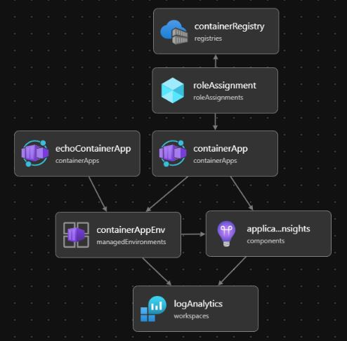
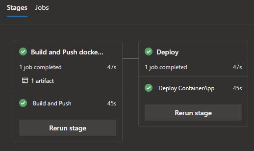

# Playing with Azure Container App
Actually, there is not much code in this repository. I experimented with the [Azure Container App](https://learn.microsoft.com/en-us/azure/container-apps/overview) and service invocation using the [Dapr](https://dapr.io/) client.

#### Resources

- [.NET Containers advancements in .NET 8](https://youtu.be/scIAwLrruMY) 📽️25 min - DotNet
- [Developing microservices with Azure Container Apps](https://youtu.be/npVfxDiEyeg) 📽️*1h - Jakob Ehn - NDC Oslo 2023*
- [Build and push Docker Images to ARC using DevOps pipelines](https://thomasthornton.cloud/2021/12/16/build-and-push-docker-images-to-azure-container-registry-using-azure-devops-pipelines) 📓*Thomas Thornton (Azure solutions architect)*
- [Authentication and authorization](https://learn.microsoft.com/en-us/azure/container-apps/authentication) 📚*Microsoft Learn*
  - [Access user claims in application code](https://johnnyreilly.com/azure-container-apps-easy-auth-and-dotnet-authentication) 📓*Johnny Reilly*
---
- [Dapr for .NET Developers](https://learn.microsoft.com/en-us/dotnet/architecture/dapr-for-net-developers) 📚*eBook*
- [Dapr Service Invocation with Azure Container Apps](https://dev.to/willvelida/dapr-service-invocation-with-azure-container-apps-41p8) 📓*Will Velida - dev.to*
- [Dapr State Management in Web API](https://dev.to/willvelida/implementing-dapr-state-management-in-aspnet-core-web-apis-42lk) 📓*Will Velida - dev.to*
- [Dapr the ultimate developer API for microservices](https://youtu.be/74A7YwsmVwM) 📽️*52min - Coding Tech - Kendall Roden - Diagrid (+workflow demo)*
- [Running your apps on Dapr](https://youtu.be/UoU7DmkXQNI) 📽️*55min - CodingNight*
- [Series of building gRPC microservice applications with Azure Container Apps and Dapr](https://bitoftech.net/2022/08/25/tutorial-building-microservice-applications-azure-container-apps-dapr) 📓*Taiseer Joudeh*
- *Geert Baeke*: [Container Apps and Dapr](https://youtu.be/s96io88CM6A) 📽️*30min* [Deploying and scaling Container Apps with Bicep and Keda](https://youtu.be/z_QnOKVpbkA) 📽️*21min*
- [Deploy to Azure Container App from ACR using Azure DevOps pipeline and Azure CLI](https://thomasthornton.cloud/2022/02/11/deploy-to-azure-container-app-from-azure-container-registry-using-a-ci-cd-azure-devops-pipeline-and-azure-cli) 📓*Thomas Thornton*
- Building microservices by using Dapr with minimum effort - *by Gökhan Gökalp*
  - 📓 [Part 1](https://www.gokhan-gokalp.com/en/building-microservices-by-using-dapr-and-net-with-minimum-effort-01) - Develop 2 simple services using a few building blocks of Dapr
  - 📓 [Part 2](https://www.gokhan-gokalp.com/en/building-microservices-by-using-dapr-and-net-with-minimum-effort-02-azure-container-apps) - Using Azure CLI to prepare Dapr components *(CosmosDB, ServiceBus)* and deploy Container App
- [Debugging Dapr applications with Visual Studio](https://laurentkempe.com/2023/02/27/debugging-dapr-applications-with-rider-or-visual-studio-a-better-way) 📓*Laurent Kempé*
---
- [Bicep](https://learn.microsoft.com/en-us/azure/azure-resource-manager/bicep/overview) 📚*Microsoft-Learn*
- [Microsoft.App - ContainerApps](https://learn.microsoft.com/en-us/azure/templates/microsoft.app/containerapps?pivots=deployment-language-bicep) 📚*Microsoft-Learn - Bicep template*
- [Bicep Playground with sample templates](https://bicepdemo.z22.web.core.windows.net)
---
- [Set up Aspire dashboard on Container App Environments](https://medium.com/@jornbeyers/tutorial-setting-up-the-net-aspire-dashboard-on-container-app-environments-891faa00c72f) 📓*Jorn Beyers*

###### The following services are defined in a bicep file

###### Deployed with Azure DevOps pipeline

